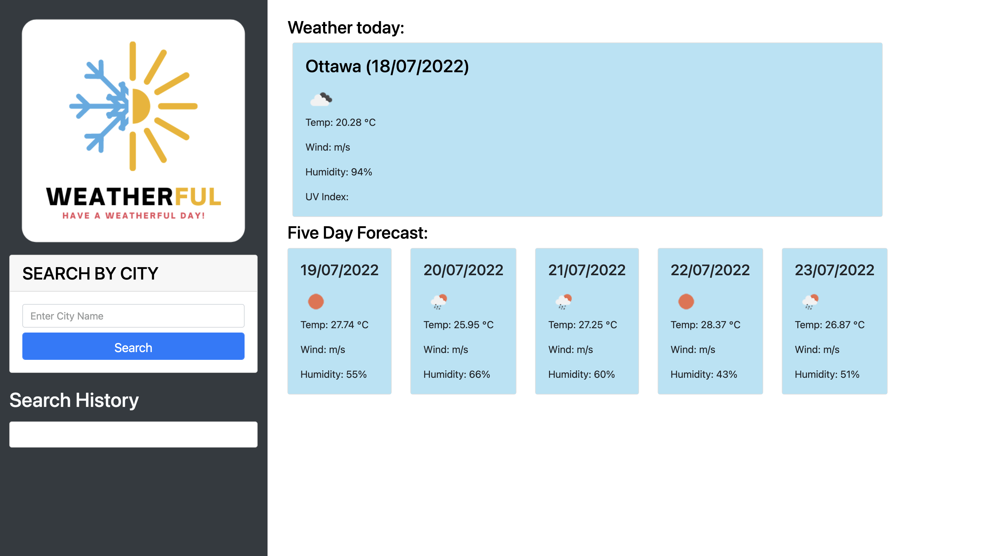

# Weatherful - Weather Dashboard

## Purpose

To create a weather dashboard displaying weather from today and the next 5 days.

## Built With

- HTML
- CSS
- Bootstrap
- JavaScript
- jQuery
- Moment.js
- OpenWeatherMap API

## Website

https://narcpat.github.io/weatherful/

## Contribution

Made with ❤️ by Patrick Narcisse (aka narcpat)

## Special Thanks

A special thanks to Ali, and my tutor Sachin as well as classmates who helped during times where I was stuck.
